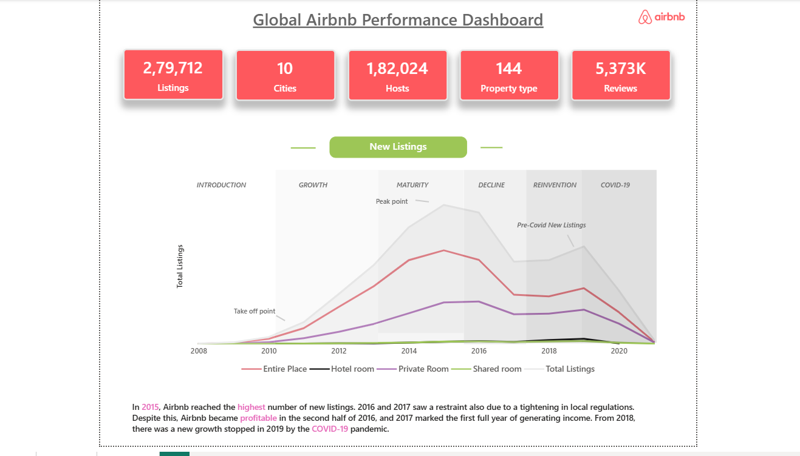
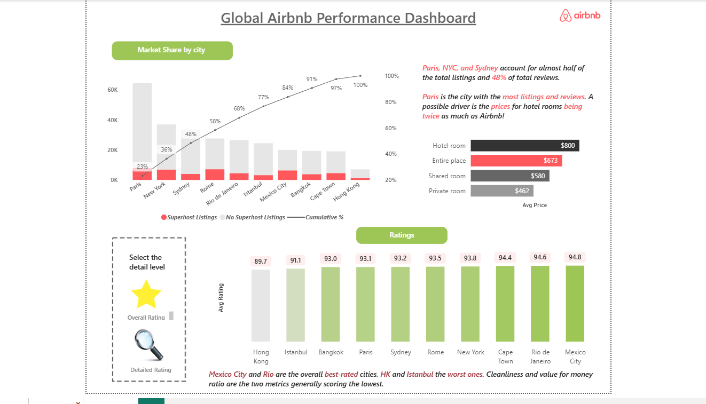
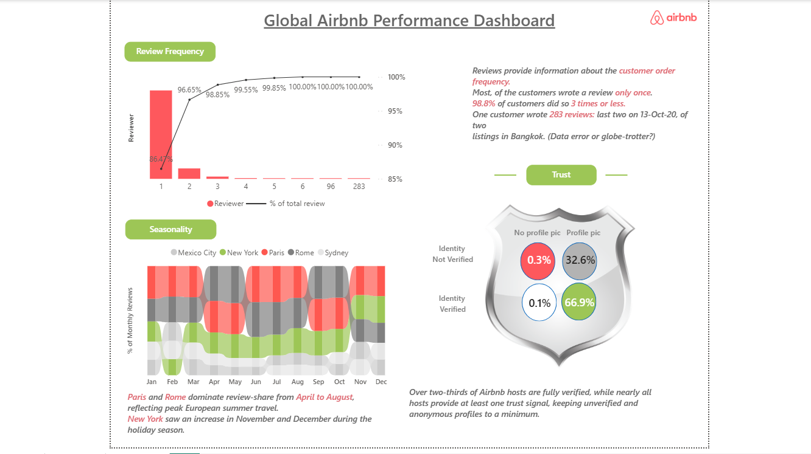

# 🏠 Global Airbnb Performance Dashboard — Power BI


> A 3-page interactive Power BI dashboard analyzing Airbnb listing, pricing, ratings, and review data across 10 global cities — uncovering market trends, customer behavior, and host trust patterns.

---

Live Dashboard Link[ https://bit.ly/4fPsYA4](https://bit.ly/3PIBGFT)

## 📊 Dashboard Preview

### Page 1 — Overview


### Page 2 — Ratings


### Page 3 — Reviews


---

## 📌 Key Metrics

| Metric | Value |
|---|---|
| 🏘️ Total Listings | 2,79,712 |
| 👤 Total Hosts | 1,82,024 |
| 🏙️ Cities Covered | 10 |
| 🏷️ Property Types | 144 |
| ⭐ Total Reviews | 5,373K |

---

## 📁 Dashboard Pages

### 🔹 Page 1 — Overview
- Tracks total listings, hosts, cities, property types, and reviews at a glance
- Lifecycle analysis of Airbnb's growth — from **Introduction → Growth → Maturity → Decline → Reinvention → COVID-19**
- **2015** marked the peak year for new listings
- Growth was restrained from **2016–2017** due to tightening local regulations
- Airbnb turned profitable in the **second half of 2016**
- New listing growth halted in **2019** due to the COVID-19 pandemic
- **Entire Place** listings dominate across all property types

### 🔹 Page 2 — Ratings & Market Share
- **Paris, NYC, and Sydney** account for nearly half of all listings and 48% of total reviews
- **Paris** leads with the most listings and reviews
- Key pricing insight: Hotel rooms average **$800** — nearly double Entire Places ($673)

| Room Type | Avg Price |
|---|---|
| Hotel Room | $800 |
| Entire Place | $673 |
| Shared Room | $580 |
| Private Room | $462 |

- **Highest-rated cities:** Mexico City (94.8) and Rio de Janeiro (94.6)
- **Lowest-rated cities:** Hong Kong (89.7) and Istanbul (91.1)
- Cleanliness and value for money are the two metrics scoring the lowest globally

### 🔹 Page 3 — Reviews & Trust
- Most customers reviewed **only once**; **98.8%** of reviewers gave 3 or fewer reviews
- **Paris and Rome** dominate review share from **April to August**, reflecting peak European summer travel
- **New York** saw a review spike in November and December during the holiday season
- **Over two-thirds (66.9%)** of Airbnb hosts are fully verified (identity verified + profile picture)
- Nearly all hosts provide at least one trust signal, keeping anonymous/unverified profiles minimal

---

## 🛠️ Tools & Skills Used

| Category | Details |
|---|---|
| **Tool** | Microsoft Power BI Desktop |
| **Language** | DAX (Data Analysis Expressions) |
| **Skills** | Data Visualization, Business Analysis, EDA, KPI Design, Storytelling |

---

## 📐 DAX Functions Used

```
CALCULATE     FILTER        ALL           ALLSELECTED
DIVIDE        DISTINCTCOUNT MAXX          VALUES
```

---

## 💡 Key Business Insights

1. **Pricing Gap** — Hotel rooms are priced ~73% higher than Entire Places, yet customer satisfaction remains competitive across room types
2. **Market Concentration** — Just 3 cities (Paris, NYC, Sydney) drive ~50% of total platform activity
3. **Review Behavior** — Airbnb's review system is sparse; the vast majority of guests review only once, suggesting reviews carry high signal value
4. **Seasonality** — European cities dominate mid-year activity; US cities peak during holidays
5. **Host Trust** — Strong verification adoption indicates a mature, trust-conscious host community
6. **COVID Impact** — The pandemic effectively halted Airbnb's growth trajectory that had been recovering post-2017

---

## 🚀 How to Use

1. Clone the repository
   ```bash
   git clone https://github.com/your-username/Global-Airbnb-Performance-Dashboard.git
   ```
2. Open `Airbnb_Global_Performance.pbix` in **Power BI Desktop**
3. Navigate between the 3 pages using the tabs at the bottom:
   - **Overview** → **Ratings** → **Reviews**
4. Use the slicers and filters to explore city-level and property-type-level insights

---

## 📬 Feedback & Connect

If you found this project useful or have suggestions, feel free to open an issue or connect with me on [LinkedIn](https://www.linkedin.com/). ⭐ Star the repo if you like it!

---


